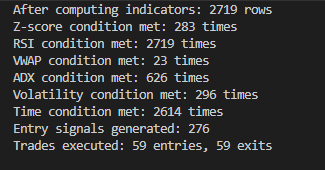
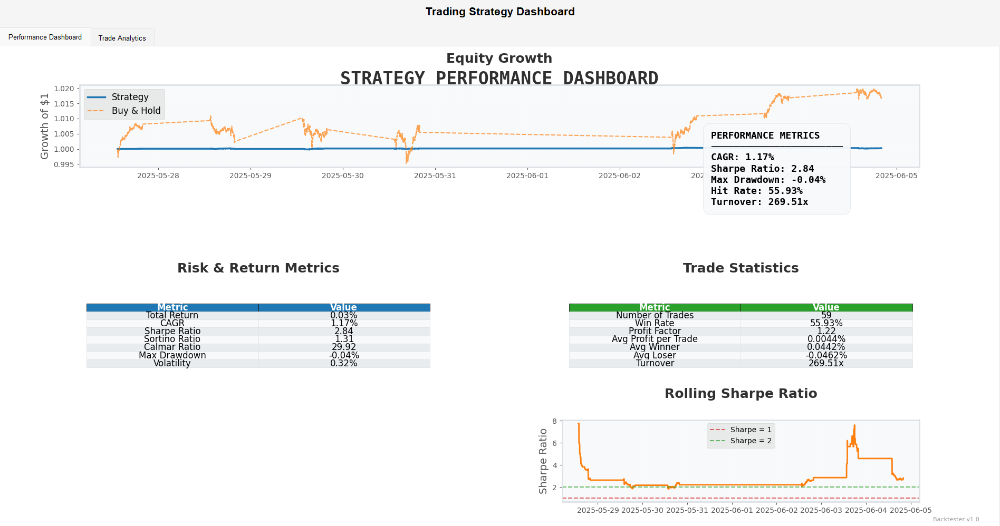
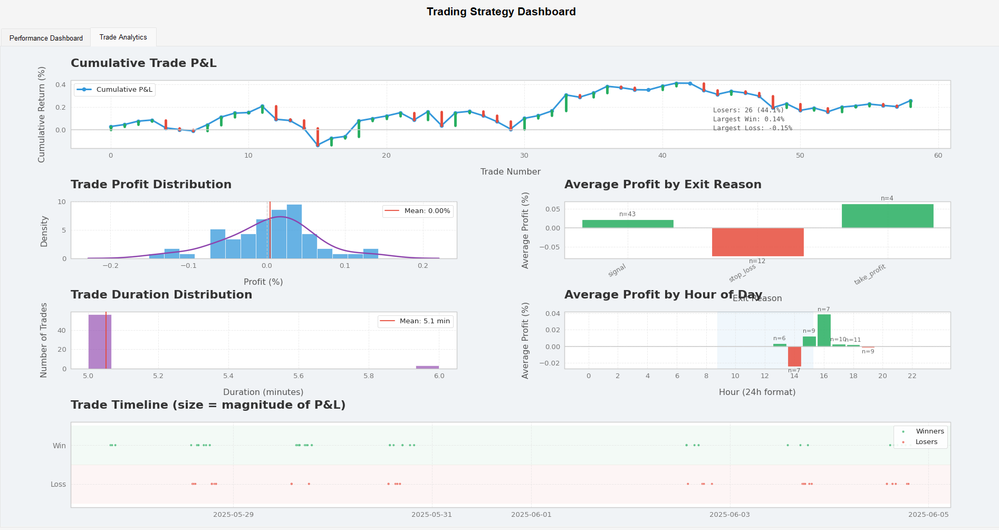

# Vectorized Mean-Reversion Backtester in Python

---

> **Question:** (Python) Implement a vectorized backtester in Python for a long-only mean-reversion strategy on minute-level OHLCV data. Your backtester must support:
>
> - Slippage simulation
> - Transaction cost modeling
> - Execution latency emulation
> - Position sizing logic based on volatility scaling
>
> **Deliverables:**
>
> - `backtester.py` with all modules
> - Performance plot (Sharpe, drawdown, CAGR, turnover, hit rate)

---

## 1. Example Output & Visualizations

### Console Output & Trade Summary



### Performance Dashboard



### Trade Analytics Dashboard



---

## Table of Contents

1.  [Example Output & Visualizations](#1-example-output--visualizations)
2.  [Overview](#2-overview)
3.  [Strategy Logic](#3-strategy-logic)
4.  [Core Features](#4-core-features)
5.  [Class: `MeanReversionBacktester`](#5-class-meanreversionbacktester)
    - [Initialization Parameters (`__init__`)](#initialization-parameters-__init__)
    - [Public Methods](#public-methods)
    - [Internal (Protected) Methods](#internal-protected-methods)
6.  [Data Requirements](#6-data-requirements)
7.  [Execution Flow](#7-execution-flow)
8.  [Detailed Output (Beyond Visuals)](#8-detailed-output-beyond-visuals)
9.  [Dependencies](#9-dependencies)
10. [How to Run](#10-how-to-run)
11. [Example Usage](#11-example-usage)
12. [Research & References](#12-research--references)

---

## 2. Overview

This Python script implements an advanced vectorized backtester for a long-only mean-reversion trading strategy, specifically designed and optimized for minute-level financial data (OHLCV). The backtester aims to provide a realistic simulation of trading by incorporating factors such as slippage, transaction costs, and execution latency. It offers a suite of comprehensive performance metrics and an interactive visual dashboard (shown in Section 1) to thoroughly analyze the strategy's effectiveness and trade characteristics.

The goal is to identify short-term price deviations from a statistical mean (or fair value) and capitalize on their expected reversion, while carefully managing risk and accounting for real-world trading frictions.

---

## 3. Strategy Logic

The core of the trading strategy revolves around identifying mean-reversion opportunities using a combination of statistical and technical indicators, subject to various filters and trade management rules.

### Entry Signal (Long-Only)

A long position is initiated if the following conditions are met:

1.  **Primary Mean-Reversion Signal (Z-Score):** The price falls significantly below its short-term moving average (MA), indicated by a Z-score dropping below a specified negative threshold (e.g., -1.5 to -2.5).
2.  **Confirmation Signal (Choose one or combine):**
    - **RSI (Relative Strength Index):** The RSI indicates an oversold condition (e.g., RSI < 30-35).
    - **VWAP (Volume Weighted Average Price):** The current price is below the session's VWAP by a certain percentage (e.g., 0.3%).
3.  **Market Condition Filters (All must be met):**
    - **ADX (Average Directional Index):** ADX must be below a threshold (e.g., < 25), indicating a non-strongly trending (ranging) market.
    - **Time-of-Day Filter:** Trading is restricted during highly volatile market opening and closing periods.
    - **(Optional) Volatility Regime Filter:** Market volatility must be within a predefined range.

### Exit Signal (Position is Closed if any of these occur)

1.  **Z-Score Reversion:** The price reverts towards or above its MA (e.g., Z-score > 0.0 or 0.5).
2.  **RSI Reversion:** The RSI moves out of the oversold territory (e.g., RSI > 55-60).
3.  **ATR-based Stop-Loss:** Price drops by a predefined multiple of ATR from the entry price.
4.  **ATR-based Take-Profit:** Price rises by a predefined multiple of ATR from the entry price.

### Trade Management Rules

- **Minimum Holding Period:** Positions must be held for a minimum duration (e.g., 5-10 minutes/bars).
- **Trade Cooldown Period:** A mandatory waiting period (e.g., 15-20 minutes/bars) after a trade closes before new signals are considered.

---

## 4. Core Features

- **Vectorized Calculations:** Leverages `pandas` and `numpy` for efficient computation.
- **Comprehensive Indicator Suite:** MA, STD, Z-score, RSI, Session VWAP, ATR, ADX.
- **Realistic Backtesting Environment:**
  - **Slippage Simulation:** ATR-based dynamic slippage.
  - **Transaction Cost Modeling:** Per-share or percentage-based commissions.
  - **Execution Latency Emulation:** Configurable delay between signal and execution.
- **Advanced Risk Management:**
  - ATR-based Stop-Loss and Take-Profit.
  - Optional Volatility-Scaled or Fixed Fractional Position Sizing.
- **Sophisticated Filtering Mechanisms:** ADX trend filter, Time-of-day filter, Optional Volatility regime filter.
- **Detailed Performance Metrics & Analytics:** CAGR, Sharpe, Sortino, Calmar, Max Drawdown, Hit Rate, Profit Factor, etc.
- **Interactive GUI Dashboard:** Multi-tabbed visual interface for performance and trade analysis (as shown in Section 1).

---

## 5. Class: `MeanReversionBacktester`

### Initialization Parameters (`__init__`)

Key parameters include:

- **Signal Parameters:** `lookback_period`, `z_entry`, `z_exit`, `rsi_lookback`, `rsi_entry`, `rsi_exit`, `adx_lookback`, `adx_threshold`, `vwap_session_group_id`, `vwap_entry_pct_diff`.
- **ATR Parameters:** `atr_lookback`, `atr_stop_loss_multiplier`, `atr_take_profit_multiplier`, `atr_slippage_multiplier`.
- **Position Sizing & Risk:** `use_volatility_sizing`, `risk_per_trade_pct`, `fixed_position_size_pct`, `max_position_size_pct`.
- **Filter Parameters (Volatility):** `use_volatility_filter`, `volatility_filter_lookback`, `min_ann_volatility`, `max_ann_volatility`.
- **Trade Management:** `min_holding_period_bars`, `trade_cooldown_bars`.
- **Execution Parameters:** `execution_delay_bars`, `commission_per_share`, `slippage_fixed_bps`.
- **Other Settings:** `long_only`, `benchmark_symbol`.

_(Refer to the `__init__` method in the source code for default values and detailed descriptions of all parameters.)_

### Public Methods

- **`load_data(df: pd.DataFrame) -> None`**: Loads and validates the input OHLCV DataFrame.
- **`run_backtest(df: pd.DataFrame) -> Dict[str, any]`**: Executes the entire backtesting pipeline.
- **`show_dashboard() -> None`**: Displays the interactive GUI dashboard.

### Internal (Protected) Methods

The class utilizes several internal methods (conventionally prefixed with `_`) to handle specific stages of the backtest, such as `_compute_indicators()`, `_generate_raw_signals()`, `_apply_position_logic()`, `_calculate_position_size()`, `_apply_execution_costs()`, `_calculate_returns()`, `_calculate_performance_metrics()`, and methods for creating dashboard figures.

---

## 6. Data Requirements

The backtester expects minute-level OHLCV (Open, High, Low, Close, Volume) data provided as a `pandas.DataFrame`.

- **Index:** Must be a `pd.DatetimeIndex`, sorted chronologically (ascending).
- **Required Columns:** `'Open'`, `'High'`, `'Low'`, `'Close'`, `'Volume'`.
- **Data Granularity:** Primarily designed for 1-minute bars. The data download utility can be adjusted for other intraday intervals (e.g., "5m", "15m"). Strategy parameters should be adjusted accordingly.
- The script includes a utility function to download historical data using `yfinance`.

---

## 7. Execution Flow

The `run_backtest` method orchestrates the backtesting pipeline:

1.  Data Loading & Preparation
2.  Indicator Computation
3.  Raw Signal Generation (with filters)
4.  Execution Latency Application
5.  Stateful Position Logic (Stops, Take-Profits, Holding Periods, Cooldowns, Trade Logging)
6.  Position Sizing Calculation
7.  Execution Cost Application (Slippage, Commissions)
8.  Return Calculation (Raw, Net, Equity Curve, Drawdowns)
9.  Performance Metric Calculation

---

## 8. Detailed Output (Beyond Visuals)

- **Return Value of `run_backtest`**: A Python dictionary containing:
  - `"data"`: The primary `pd.DataFrame` with all intermediate calculations.
  - `"equity_curve"`: `pd.Series` of the cumulative net returns.
  - `"returns"`: `pd.Series` of the periodic net returns.
  - `"metrics"`: Dictionary of calculated performance statistics.
  - `"trades"`: `pd.DataFrame` detailing individual executed trades.
- **Console Output**: Status messages, debug counts for signal conditions, and a summary of performance metrics.

---

## 9. Dependencies

- `numpy`
- `pandas`
- `matplotlib`
- `seaborn`
- `yfinance`
- `tkinter` (Usually standard; on Linux, may require `sudo apt-get install python3-tk`)

## 10. How to Run

- Ensure Dependencies are installed.
- Save the Code as a Python file (e.g., `mean_reversion_dashboard_backtester.py`).
- Configure Parameters in the `if __name__ == "__main__":` block:

  - Set the `symbol_to_test` (e.g., "SPY").
  - Adjust `data_lookback_days` and `data_interval` for data download.
  - Modify `MeanReversionBacktester` initialization parameters for the strategy.

- **Execute from Terminal:**
  ```bash
  python mean_reversion_dashboard_backtester.py
  ```

## 11. Example Usage

The `if __name__ == "__main__":` block in the script provides a ready-to-run example:

```python
# Example snippet from the main execution block:

if __name__ == "__main__":
    # 1. Define Symbol and Data Parameters
    symbol_to_test = "SPY" # Customizable: e.g., "AAPL", "MSFT", "QQQ"
    data_lookback_days = 15
    data_interval = "1m" # Data timeframe: "1m", "5m", "15m", etc.

    # (Data download logic as in the script)

    # 2. Initialize Backtester
    backtester_instance = MeanReversionBacktester(
        lookback_period=30, z_entry=-2.0, # ... other params ...
    )

    # 3. Run the Backtest & Show Results
    # (Data loading, backtest execution, dashboard display, metric printing as in the script)
```
