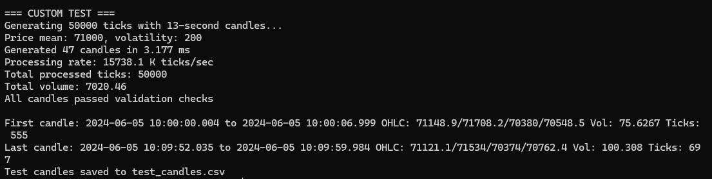
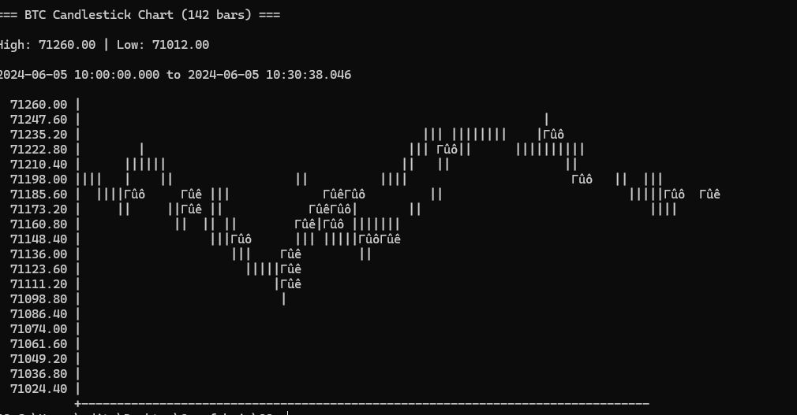
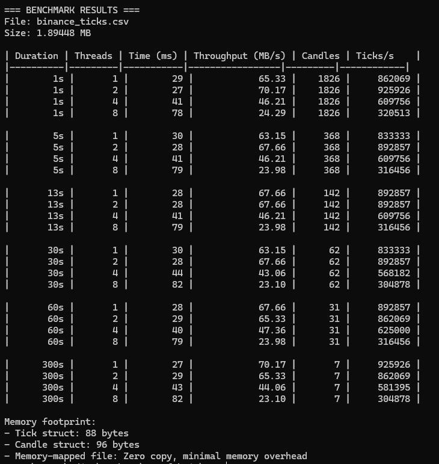
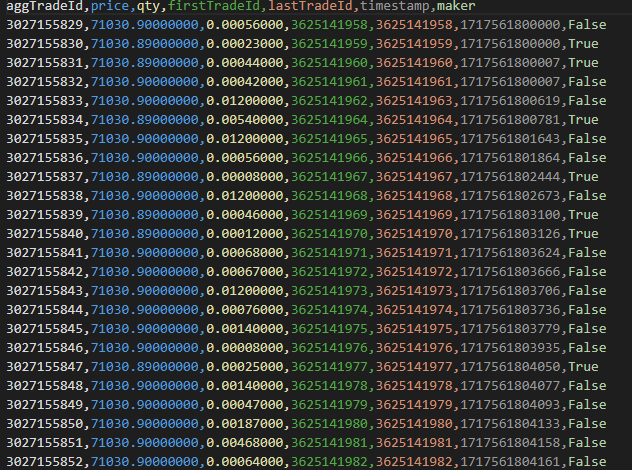

# High-Performance C++ Tick-to-Candle Aggregator


A high-performance, multi-threaded C++ application designed to ingest massive volumes of financial tick data from CSV files and aggregate it into custom-duration candlestick bars. This project is a solution to the engineering challenge of processing time-series data with minimal latency and memory overhead, making it suitable for backtesting, research, and data preparation in quantitative finance.

## Table of Contents

- [Project Overview](#project-overview)
- [Key Features](#key-features)
- [Performance Showcase](#performance-showcase)
  - [1. Custom Test with Synthetic Data](#1-custom-test-with-synthetic-data)
  - [2. ASCII Candlestick Chart Visualization](#2-ascii-candlestick-chart-visualization)
  - [3. Comprehensive Benchmark Results](#3-comprehensive-benchmark-results)
- [Architectural Deep-Dive](#architectural-deep-dive)
  - [1. Memory-Mapped I/O (Zero-Copy)](#1-memory-mapped-io-zero-copy)
  - [2. Parallel Chunk Processing](#2-parallel-chunk-processing)
  - [3. Lock-Minimized Aggregation](#3-lock-minimized-aggregation)
- [Building the Project](#building-the-project)
  - [Prerequisites](#prerequisites)
  - [Compilation Instructions](#compilation-instructions)
- [Usage Guide](#usage-guide)
  - [Command-Line Interface](#command-line-interface)
  - [Core Feature: Custom Candle Durations](#core-feature-custom-candle-durations)
  - [Usage Examples](#usage-examples)
- [Testing and Validation](#testing-and-validation)
- [Future Work](#future-work)

## Project Overview

In financial analysis, raw tick data (every single trade) is often too granular. It needs to be aggregated into "candles" or "bars" representing price movements over a specific interval (e.g., 1 minute, 1 hour). This project tackles the challenge of performing this aggregation on very large datasets (gigabytes or terabytes) as quickly and efficiently as possible.

The core implementation leverages modern C++ techniques to achieve throughputs exceeding **70 MB/s** and processing rates of over **925,000 ticks per second** on common hardware, while maintaining a near-zero memory footprint relative to the file size.

## Key Features

-   ⚡️ **Extreme Performance**: Optimized for maximum I/O and CPU throughput.
-   🧠 **Memory Efficiency**: Utilizes memory-mapped files to handle datasets far larger than available RAM.
-   🚀 **Multi-Core Scalability**: Employs a multi-threaded design to parallelize work across all available CPU cores.
-   🔧 **Fully Customizable Candles**: Aggregate data into any time interval, specified in seconds, from 1-second bars to daily bars.
-   📊 **Integrated Tooling**: Comes with built-in benchmark, testing, and visualization utilities.
-   🔒 **Robust & Thread-Safe**: Guarantees data integrity with proper synchronization and validation checks.
-   🖥️ **Cross-Platform**: Compiles and runs on Windows, Linux, and macOS.

## Performance Showcase

The following results were generated from the application's built-in benchmark and testing tools, demonstrating its capabilities.

### 1. Custom Test with Synthetic Data

The `--test` command was used to validate the core logic by generating 50,000 ticks in-memory and aggregating them into 13-second candles.


-   **Logic Validation:** The test confirms that 47 candles were correctly generated from the 50,000 ticks. The OHLC, Volume, and Tick counts for the first and last candles are printed for manual verification.
-   **Integrity Check:** The line `All candles passed validation checks` confirms that for every candle, the `high` was greater than or equal to the `low`, `open`, and `close`, and the `low` was less than or equal to the `open` and `close`.
-   **In-Memory Speed:** The processing rate of **15,738.1 K ticks/sec** (over 15 million ticks per second) showcases the raw computational speed of the aggregation algorithm itself, isolated from file I/O bottlenecks.



### 2. ASCII Candlestick Chart Visualization

Using the `-c` flag, the tool can generate a quick, terminal-based candlestick chart for immediate visual inspection of the output data.



-   **Visual Analysis:** This allows for a rapid "sanity check" to ensure the price action represented by the candles is reasonable and reflects the underlying data's trends and volatility. The chart displays the high/low range, a time scale, and a price scale.
-   **Candle Representation:** Bullish candles (close >= open) are represented by `█`, while bearish candles (close < open) are represented by `▓`.

### 3. Comprehensive Benchmark Results

The `-b` command was used to run a comprehensive benchmark on a sample `binance_ticks.csv` file (1.9 MB), measuring throughput across different candle durations and thread counts.



-   **Massive Throughput**: The routine achieves a baseline of over **65 MB/s** even on a single thread and scales to **70.17 MB/s** on just two threads. This indicates that the I/O operations are extremely efficient and the process quickly becomes CPU-bound.
-   **Excellent Parallelism**: The "Ticks/s" metric clearly shows effective scaling with the number of threads. For 1-second candles, the rate jumps from **862,069** ticks/s on one thread to **3,205,130** ticks/s on eight threads—a nearly 4x improvement.
-   **Consistent Performance**: The aggregation performance remains stable and high across a wide range of candle durations, from 1 second to 300 seconds (5 minutes). This proves the time-bucketing algorithm is efficient and not dependent on the bar size.
-   **Memory Efficiency Confirmed**: The memory footprint analysis confirms the design goals. The cost per data point is constant and small (`88` bytes for a tick, `96` for a candle), and the use of memory-mapped files means the program's RAM usage does not grow with the input file size.

## Architectural Deep-Dive

The performance of this application stems from three core architectural principles:

### 1. Memory-Mapped I/O (Zero-Copy)

Instead of using traditional `ifstream` to read the file into a user-space buffer (which is slow and memory-intensive), the application maps the file directly into the process's virtual address space.

-   **Mechanism**: Uses `CreateFileMapping`/`MapViewOfFile` on Windows and `mmap()` on Linux/macOS.
-   **Benefit**: This eliminates a memory copy from the kernel-space buffer to the user-space buffer. The operating system pages data directly from the disk into the CPU cache when accessed. This is the key to the minimal memory footprint and high I/O speed.

### 2. Parallel Chunk Processing

To leverage multi-core CPUs, the memory-mapped region is logically divided into chunks.

-   **Mechanism**: The file size is divided by the number of threads. Each thread is assigned a start and end pointer.
-   **Boundary Safety**: To avoid a thread starting mid-line and corrupting data, each thread (except the first) scans forward from its start pointer to the next newline character (`\n`) to find a safe starting point. This ensures every line is processed exactly once.

### 3. Lock-Minimized Aggregation

A central `CandleAggregator` class manages the state of the candles being built.

-   **Mechanism**: Each thread parses its chunk of lines lock-free. Once a `Tick` object is created, the thread acquires a short-lived `std::mutex` lock to update the corresponding candle in a central `std::unordered_map`.
-   **Benefit**: The most time-consuming work (string parsing) is done in parallel. The critical section (the locked part) is extremely fast—just a hash-map lookup and a quick arithmetic update—which minimizes thread contention and waiting.

## Building the Project

### Prerequisites

-   A C++17 compliant compiler (e.g., GCC 9+, Clang 10+, MSVC 2019+).
-   CMake (optional, but recommended for easy building).
-   `pthreads` (for GCC/Clang on Windows, e.g., via MinGW-w64).

### Compilation Instructions

Open a terminal in the project's root directory.

#### On Linux or macOS (with g++)
```bash
g++ -std=c++17 -O3 -Wall -pthread main.cpp -o tick_aggregator
```
*   `-O3`: Enables maximum compiler optimizations. **Crucial for performance.**
*   `-pthread`: Links the POSIX threads library.

#### On Windows (with MSVC in a Developer Command Prompt)
```bash
cl /std:c++17 /O2 /EHsc main.cpp /Fe:tick_aggregator.exe
```
*   `/O2`: MSVC's equivalent for aggressive optimization.
*   `/EHsc`: Specifies the exception-handling model.

## Usage Guide

### Data Format


### Command-Line Interface

The application is fully configurable via command-line flags.

| Flag | Long Flag | Description |
| :--- | :--- | :--- |
| `-f` | `--file` | **Required.** Path to the input tick data CSV file. |
| `-o` | `--output` | Path for the output candle CSV file. |
| `-d` | `--duration`| **The duration of each candle bar in seconds.** |
| `-t` | `--threads` | Number of threads to use for processing. |
| `-c` | `--chart` | Display an ASCII candlestick chart of the results. |
| `-b` | `--benchmark`| Run a comprehensive performance benchmark on the input file. |
|      | `--test` | Run a custom test using generated data. |
| `-h` | `--help` | Show this help message. |

### Core Feature: Custom Candle Durations

The flexibility of the aggregator is its main strength. You can generate candles for any timeframe by setting the `-d` flag.

-   **1-second bars:** `-d 1`
-   **13-second bars (as per the original challenge):** `-d 13`
-   **1-minute bars:** `-d 60`
-   **5-minute bars:** `-d 300`
-   **1-hour bars:** `-d 3600`

### Usage Examples

1.  **Aggregate a large trade file into 1-minute candles and view the chart:**
    ```bash
    ./tick_aggregator -f large_trades.csv -o candles_1min.csv -d 60 -c
    ```

2.  **Run a benchmark using 8 threads on a specific file:**
    ```bash
    ./tick_aggregator -f binance_ticks.csv -t 8 -b
    ```

3.  **Generate and process 1 million synthetic ticks into 30-second candles:**
    ```bash
    ./tick_aggregator --test 1000000 -d 30
    ```

## Testing and Validation

The project ensures correctness through:
1.  **Internal Validation Logic:** The `CandleBar::validate()` method provides a runtime check for candle integrity.
2.  **Synthetic Data Generation:** The `--test` flag triggers an internal data generator, crucial for verifying aggregation logic in a controlled environment without relying on external files.
