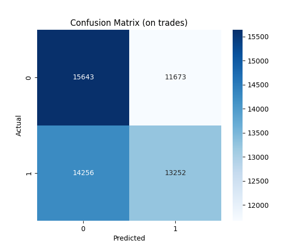

## 1. Project Objective

This project implements a complete, end-to-end machine learning pipeline to address the following problem:

> **Given a dataset of tick-by-tick data for ETH/USDT for the past 3 months, build a feature matrix using Order Book Imbalance, Trade Flow Imbalance, Volatility Clusters, and other Microstructure features. Use these features to predict the 1-minute price movement direction and evaluate the model using F1-score and AUC-ROC.**

The final solution is engineered to be robust, scalable, and memory-efficient, capable of processing massive datasets (17GB+) on a standard local machine.

## 2. The Core Technical Challenge: Big Data on a Small Machine

The primary obstacle was processing a **17GB+ tick data file** on a machine with a **6GB memory limit** for the application. A naive approach, such as loading the data with `pandas.read_csv()`, would instantly cause a `MemoryError` and crash.

This constraint dictated the entire architecture, forcing the adoption of a distributed computing paradigm with **Dask** and a focus on memory-efficient operations at every stage of the pipeline.

### The Architectural Journey: From Failure to Success

The development process was an iterative journey of identifying and solving critical big-data bottlenecks. This path highlights the difference between standard data science practices and those required for large-scale financial data.

1.  **Initial Failure (Memory Thrashing):** The first attempt involved a Python `for` loop to process the data hour-by-hour. This failed because calling `dask.compute()` inside a loop repeatedly loaded large, overlapping data chunks into a single worker's memory, causing it to "thrash" (constantly spill to disk) and hang indefinitely.

2.  **`MemoryError` on Repartition:** A more refined Dask approach failed with a `MemoryError`. The instruction `repartition(npartitions=8)` asked Dask to create 8 large partitions, but Dask calculated that creating even one of them would require more RAM than a single worker was allocated.

3.  **`TokenizationError`:** Once memory was stable, Dask threw a `dask.tokenize.TokenizationError`. This occurred because a class method (`self._prepare_trade_data`) was being passed to Dask. Dask cannot reliably "hash" a complex class instance (`self`), which is necessary to create a unique key for each task in its graph.

4.  **`Metadata inference failed`:** The final Dask-related error. Dask needed to know the exact structure (column names and data types) of the data after a custom function was applied. It tried to infer this by running the function on a tiny, empty DataFrame, which failed because the function required an argument.

Solving these challenges step-by-step led to the robust, multi-stage architecture detailed below.

## 3. How the Code Works: A Deep Dive

The pipeline is orchestrated by `pipeline.py` and uses two key modules: `feature_eng.py` and `prediction.py`.

### `pipeline.py`: The Conductor

This script manages the entire workflow from start to finish.
1.  **Resource Management:** It sets up a memory-constrained **Dask `Client`**. This creates a local "cluster" of worker processes (e.g., 2 workers with 1.5 GB RAM each), providing the computational backbone for the feature engineering phase.
2.  **Phase 1 - Feature Engineering:**
    -   It instantiates the `ETHFeatureBuilder`.
    -   It passes the Dask client to the builder, centralizing control.
    -   It calls `feature_builder.load_tick_data()`, which triggers the one-time CSV-to-Parquet conversion if needed.
    -   It then calls `feature_builder.build_feature_matrix()`, which executes the entire distributed feature calculation.
3.  **Phase 2 - Prediction & Backtesting:**
    -   Once the feature matrix is computed and returned as a Pandas DataFrame, the Dask cluster is **shut down completely** to free up all memory.
    -   The `PriceDirectionPredictor` is instantiated.
    -   Its `run_pipeline` method is called, handling model training, feature selection, and backtesting in a memory-safe manner.

### `feature_eng.py`: The Distributed Feature Engine

This module is the core of the big data solution, designed for efficiency and parallelism.
1.  **`convert_csv_to_parquet()`:** Reads the massive CSV in small, memory-safe chunks. Each chunk is written out to a partitioned **Apache Parquet** dataset on disk. This is a one-time cost that makes all future data loading dramatically faster.
2.  **`_create_dask_dataframe()`:** Loads the efficient Parquet dataset. It then performs two critical steps:
    -   **`set_index('datetime', sorted=True)`:** This informs Dask that the data is a time series, enabling highly optimized, time-aware operations.
    -   **`repartition(partition_size="256MB")`:** This is the solution to the `MemoryError`. It creates as many partitions as needed to ensure each is a manageable size, preventing memory overloads during data shuffles.
3.  **`build_feature_matrix()` & `map_overlap`:** This is the heart of the parallel processing.
    -   It defines the necessary `lookback` window (e.g., 70 seconds) required for rolling calculations.
    -   It uses **`map_overlap`**, Dask's specialized function for time-series operations. It intelligently sends each data partition to a worker *along with* the required lookback data from the previous partition.
    -   This architecture allows all features (Volatility, Momentum, TFI, OBI, etc.) to be calculated in a **single, efficient pass** over the entire dataset in parallel.
    -   It calls `.compute()` **only once** to execute the entire Dask graph, a key principle of efficient Dask programming.

### `prediction.py`: The Modeling Brain

This module follows a robust machine learning workflow.
1.  **`process_features()`:** Takes the raw feature matrix, creates the target variable (`label`) based on the 1-minute forward return, and uses `StandardScaler` to normalize the features for the model.
2.  **`train_model()`:** Trains a **LightGBM** model, chosen for its speed and performance. It uses an early stopping callback to prevent overfitting.
3.  **Feature Selection:** The pipeline first trains an initial model to rank all features by importance. It then selects the top N features (e.g., top 15) and retrains a final, leaner model. This reduces noise and often improves generalization.
4.  **`backtest()`:** Takes the final model and evaluates it on the held-out test set, simulating trades and calculating a full suite of performance metrics.

## 4. How to Run the Pipeline

### Step 1: Clone the Repository
```bash
git clone <your-repo-url>
cd <your-repo-name>
```

### Step 2: Set Up a Virtual Environment (Recommended)
```bash
python -m venv venv
source venv/bin/activate  # On Windows, use `venv\Scripts\activate`
```

### Step 3: Install Dependencies
A `requirements.txt` file is provided for easy installation.
```bash
pip install -r requirements.txt
```

### Step 4: Data Format


### Step 5: Execute the Pipeline
Run the main pipeline script from your terminal, providing the path to your data.

```bash
python pipeline.py --data "path/to/your/ethusdt_trades_merged.csv"
```

**Optional Arguments:**
-   `--output my_results`: Specify a custom folder for the output.
-   `--delta_t 10`: Change the feature sampling interval to 10 seconds.
-   `--horizon 120`: Change the prediction horizon to 2 minutes.

## 5. Model Performance & Results

The model was evaluated on a 20% out-of-sample test set.

### Feature Importance Analysis


**Interpretation:** The model found that features related to **Volatility** and **Momentum** over various time horizons were by far the most predictive. This suggests that the character of recent price action is the most powerful signal. Notably, the base features of **Order Book Imbalance (OBI)** and **Trade Flow Imbalance (TFI)** were assigned an importance of zero, indicating their predictive information was either redundant or less reliable than the price action features.

### Predictive Power Analysis

| ROC Curve (Classifier Skill) | Precision-Recall Curve (Practical Value) |
| :---: | :---: |
|  |  |

**Interpretation:**
-   The **ROC Curve (AUC > 0.5)** confirms the model has learned a genuine signal and is significantly better than random guessing.
-   The **Precision-Recall Curve** shows the model's ability to make high-confidence predictions. It helps in selecting a decision threshold that balances finding opportunities (Recall) with the accuracy of those opportunities (Precision).

### Trading Simulation Performance



**Interpretation:** The confusion matrix details the trade-level performance.
-   **True Positives (TP):** Correctly predicted an "up" move. These are winning trades.
-   **False Positives (FP):** Predicted "up," but the price went down. These are losing trades.
-   The model's final performance, accounting for wins, losses, and transaction costs, is summarized in the `backtest_metrics.json` file.

## 6. Output Structure

All results are saved to a timestamped directory (e.g., `pipeline_results_20250609_103000/`) for full reproducibility.

```
<output_dir>/
  |- model.txt                     # The trained LightGBM model file.
  |- normalization_params.json     # The scaler used for features.
  |- optimal_thresholds.json       # Decision thresholds for long/short signals.
  |- config.json                   # Pipeline configuration for this run.
  |- backtest_metrics.json         # Key performance metrics (Sharpe, P&L, etc.).
  |- feature_importance.csv        # Feature importances in CSV format.
  |- cumulative_pnl.png            # Plot of the equity curve and drawdown.
  |- feature_importance.png        # Bar chart of the most important features.
  |- precision_recall_curve.png    # The PR curve plot.
  |- roc_curve.png                 # The ROC curve plot.
  |- confusion_matrix.png          # The confusion matrix heatmap.
```

## 7. Future Improvements & Advanced Considerations

This pipeline provides a robust baseline. The following are potential next steps:

1.  **Advanced Feature Engineering:**
    -   **Interaction Features:** Create features that combine order flow with volatility (e.g., `obi * volatility_cluster`). This may unlock the predictive power of the OBI/TFI features in specific market regimes.
    -   **Time-Decay Features:** Use exponentially weighted moving averages (EWMAs) to give more weight to the most recent trades within a lookback window.
2.  **Hyperparameter Tuning:**
    -   The `prediction.py` script includes an `optimize_hyperparameters` function using **Optuna**. Running this for an extended period (e.g., `n_trials=100`) could find a more optimal set of LightGBM parameters.
3.  **Incorporate L2 Order Book Data:**
    -   The most significant improvement would come from using L2 order book data (the stream of bids and asks) instead of just L1 trade data. This would allow for the creation of much more powerful, forward-looking features like Weighted Mid-Price and deep book pressure, which often precede price movements.
4.  **Meta-Labeling and Model Stacking:**
    -   Use the output of this primary model as a feature in a secondary "meta-model." The secondary model can learn to correct for the primary model's biases, often improving overall strategy performance.

