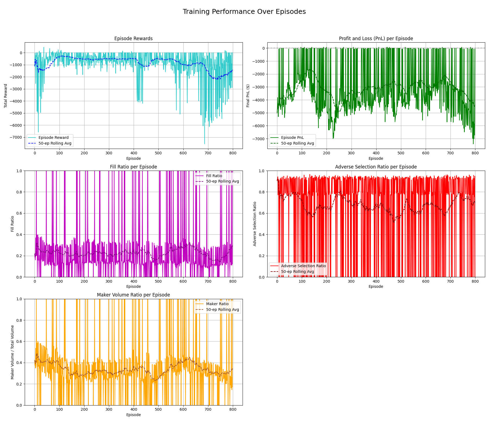

# Deep Reinforcement Learning for Algorithmic Market Making

This repository contains a high-fidelity simulation and training framework for developing a market-making agent using Deep Reinforcement Learning. The agent, powered by Proximal Policy Optimization (PPO), learns to operate on a limit order book (LOB) by processing Level 2 market data, making it a realistic and challenging environment for algorithmic trading research.

The project is self-contained, featuring a custom `gymnasium`-based environment, a high-performance L2 order book, and a complete pipeline for training, evaluation, and visualization.




---

## Table of Contents
1. [The Core Problem](#1-the-core-problem)
2. [Architectural Overview](#2-architectural-overview)
3. [How to Get Started](#3-how-to-get-started)
    - [Prerequisites](#prerequisites)
    - [Installation](#installation)
    - [Data Format](#data-format)
4. [How to Use the Framework](#4-how-to-use-the-framework)
    - [Training a New Agent](#training-a-new-agent)
    - [Evaluating a Trained Agent](#evaluating-a-trained-agent)
5. [Interpreting the Results](#5-interpreting-the-results)
6. [Project Evolution & Key Challenges](#6-project-evolution--key-challenges)
7. [Future Work & Potential Improvements](#7-future-work--potential-improvements)


## 1. The Core Problem

The primary objective was to design and implement an autonomous agent capable of learning a profitable market-making strategy. This addresses the foundational question:

> **Can a Reinforcement Learning agent learn to effectively place, cancel, and execute orders on a simulated limit order book to achieve profitability while managing risk?**

To answer this, the agent must learn to navigate the fundamental trade-offs of market making:
-   **Joining the Spread**: Placing passive limit orders to earn the spread, but risking that the orders go unfilled.
-   **Crossing the Spread**: Executing aggressive market orders to guarantee a trade, but paying a fee and a cost for immediacy.
-   **Managing Inventory**: Keeping its net position close to zero to avoid directional risk.
-   **Avoiding Adverse Selection**: A key risk where an informed trader takes the agent's passive order just before the market price moves unfavorably.

The success of the agent is measured against three critical performance indicators:
-   **PnL (Profit and Loss)**: The ultimate measure of profitability.
-   **Fill Ratio**: The agent's ability to get its passive orders executed.
-   **Adverse Selection Ratio**: The agent's ability to manage the risk of trading against informed flow.

## 2. Architectural Overview

The project is built on a modular, event-driven architecture that mirrors professional backtesting systems.


-   **Data Layer (`data_processor.py`)**: Ingests raw, line-delimited JSON files containing L2 order book data. It parses each line into either a `SnapshotMessage` (a full book state) or a `DeltaMessage` (an incremental update), which is the standard for real-time data feeds.
-   **Simulation Core**:
    -   **`order_book.py`**: A high-performance L2 order book built using `sortedcontainers.SortedDict`. It efficiently processes snapshots and deltas, providing fast lookups for the best bid/ask and book depth. It does not track individual non-agent orders, focusing only on the aggregated liquidity at each price level.
    -   **`event_driven_env.py`**: The central `gymnasium` environment. It orchestrates the entire simulation loop. On each `step`, it processes the next market data message, updates the order book, simulates the agent's action, checks for fills based on BBO-crossing logic, and calculates rewards. It also implements a "markout" mechanism to accurately measure adverse selection by comparing a trade's fill price to the mid-price a few steps in the future.
-   **Intelligence Layer**:
    -   **`market_features.py`**: A feature engineering module that calculates insightful market microstructure features from the raw order book state. These include volatility, order flow imbalance (OFI), and micro-price, providing the agent with a rich understanding of market dynamics.
    -   **`ppo_agent.py` & `ppo_network.py`**: The PPO agent and its underlying neural network architecture. The network uses a combination of 1D Convolutional layers (to extract spatial features from the book levels) and LSTM layers (to capture temporal dependencies), making it well-suited for time-series data.
-   **Execution & Analysis**:
    -   **`train.py` & `evaluate.py`**: High-level scripts for running training and evaluation experiments. They handle argument parsing, setting up the components, and managing the overall workflow.
    -   **`utils.py`**: A suite of utilities for calculating financial metrics (Sharpe Ratio, Sortino Ratio) and generating the comprehensive visualizations that are crucial for analyzing agent performance.

## 3. How to Get Started

### Prerequisites
- Python 3.10 or newer
- An NVIDIA GPU with CUDA drivers is highly recommended for accelerating TensorFlow training, but not strictly required.

### Installation

1.  **Clone the repository:**
    ```bash
    git clone https://github.com/your-username/your-repo-name.git
    cd your-repo-name
    ```


2.  **Install all dependencies:** It is highly recommended to use a virtual environment.
    ```bash
    # Create and activate a virtual environment (optional but recommended)
    python -m venv venv
    source venv/bin/activate  # On Windows, use `venv\Scripts\activate`

    # Install the required packages
    pip install -r requirements.txt
    ```

### Data Format
This framework is designed to work with **line-delimited JSON (`.jsonl`)** files containing L2 market data. Each line in the file should be a valid JSON object representing either a `snapshot` or a `delta` update.The data was downloaded from the Bybit website (orderbook data) for the ETHUSDT contract.

**Example `snapshot` line:**
```json
{"type": "snapshot", "ts": 1672531200000, "data": {"b": [["23000.5", "1.5"], ["23000.0", "2.0"]], "a": [["23001.0", "0.5"], ["23001.5", "3.1"]]}}
```

**Example `delta` line:**
```json
{"type": "delta", "ts": 1672531200500, "data": {"b": [["23000.5", "0.0"]], "a": [["23001.0", "0.8"]]}}
```
- `ts`: Timestamp in **milliseconds**.
- `b`: A list of bid updates `["price", "size"]`. A size of `"0.0"` indicates the price level should be removed.
- `a`: A list of ask updates `["price", "size"]`.

## 4. How to Use the Framework

### Training a New Agent
The `train.py` script is the entry point for training. The only required argument is the path to your data file.

```bash
python train.py --data_path /path/to/your/market_data.jsonl
```

A new directory will be created in `results/` containing the trained models, a `params.json` file with the hyperparameters used, and plots visualizing the training progress.

**Tuning Hyperparameters:**
You can easily override default hyperparameters via command-line flags. This is the recommended way to run experiments.

```bash
# Example: Train for 500 episodes with a higher inventory penalty and smaller learning rate
python train.py --data_path /path/to/data.jsonl \
                --num_episodes 500 \
                --inventory_penalty 0.05 \
                --learning_rate 1e-5
```

### Evaluating a Trained Agent
Use the `evaluate.py` script to test the performance of a saved model. You must provide the path to the model directory and the data file to test on.

```bash
python evaluate.py --model_path results/l2_ppo_training_.../models/final_model \
                   --data_path /path/to/your/evaluation_data.jsonl
```

This will run a number of evaluation episodes (10 by default) and print the average performance metrics.

**Visualizing an Evaluation Episode:**
To get a detailed, step-by-step plot of the agent's trades, PnL, and inventory for the first evaluation episode, add the `--visualize_first` flag.

```bash
python evaluate.py --model_path ... --data_path ... --visualize_first
```

All evaluation outputs, including a `evaluation_summary.csv` and summary plots, are saved in a new directory inside `evaluation_results/`.

## 5. Interpreting the Results
The generated plots provide deep insights into the agent's learned behavior.
-   **Episode Rewards vs. PnL**: The agent optimizes for `Reward`, which includes penalties. The `PnL` is the real-world outcome. A good agent will show both trending upwards. If reward improves but PnL doesn't, it means the agent is just minimizing penalties, not making profit.
-   **Fill Ratio**: A low fill ratio suggests the agent is too passive. A high fill ratio suggests it's placing orders very close to the market, which can be risky.
-   **Adverse Selection Ratio**: This is the most sophisticated metric. A ratio near 1.0 means the agent is consistently being "picked off" by informed traders. A ratio near 0 means the agent is too passive to get meaningful fills. **A successful market maker will have a low but non-zero adverse selection ratio**, indicating it is managing this risk effectively.
-   **Maker Volume Ratio**: Shows the agent's style. A high ratio indicates a passive, spread-capturing strategy. A low ratio indicates an aggressive, liquidity-taking strategy.

## 6. Project Evolution & Key Challenges
The project underwent a significant architectural evolution to increase its realism and accuracy.

-   **Initial Concept (L3 Simulation)**: The first prototype was based on an L3-style simulation, processing every single order. While granular, this was computationally prohibitive in Python and relied on synthetic data.
-   **Pivot to L2 Architecture (Current State)**: The project was refactored to use a professional-grade L2 data model. This switch brought major benefits in performance and realism but introduced new challenges, such as implementing a robust L2 order book, designing a realistic fill simulation, and handling random-access starts in large data files.
-   **Debugging and Stabilization**: The complexity of the event-driven simulation led to subtle bugs. Key challenges included fixing an `IndexError` in the order book data retrieval and a `ZeroDivisionError` in metric calculations for episodes with no trading activity.
-   **Learning Dynamics and Hyperparameter Tuning**: The most significant RL challenge was observing the agent converge to a suboptimal, passive strategy. The solution involved iterative hyperparameter tuning and, crucially, enhancing the visualizations to track not just reward but all key business metrics, which provided the necessary insight to diagnose the agent's behavior.

## 7. Future Work & Potential Improvements
-   **State Normalization**: Implement a `gymnasium` observation wrapper to normalize the state features, which currently have vastly different scales. This is a standard technique that can significantly stabilize and accelerate learning.
-   **Advanced Action Spaces**: Experiment with a `MultiDiscrete` action space, allowing the agent to choose not only the action type but also the size of the order and its price level relative to the BBO.
-   **More Sophisticated Reward Function**: Engineer a more complex reward function that explicitly rewards profitable round-trip trades or uses a risk-adjusted metric like Sharpe ratio as a component.
-   **Latency Modeling**: Introduce stochastic latency to agent actions to better simulate the uncertainties of network travel time in a real-world trading environment.
-   **Multi-Asset Framework**: Extend the environment to handle multiple trading pairs, forcing the agent to learn capital allocation and manage a portfolio-level inventory risk.