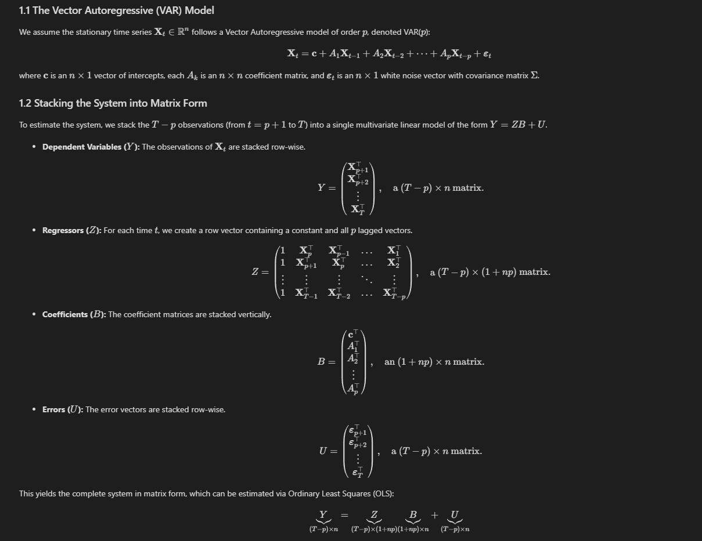
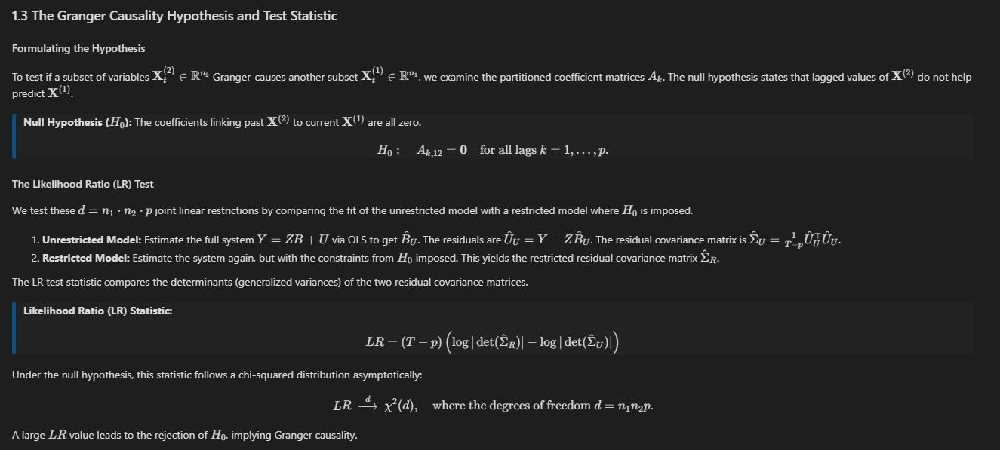
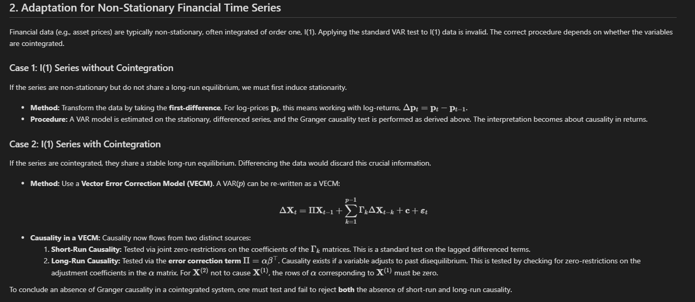

# Granger Causality Test: Derivation and Adaptation

> **Question:** Given a multivariate time series $\mathbf{X}_t \in \mathbb{R}^n$, derive the Granger causality test in matrix form and describe how you would adapt it for non-stationary financial time series.

---

This repository contains a formal mathematical derivation of the Granger causality test for multivariate time series. It covers the derivation in full matrix form for stationary processes and details the necessary adaptations for non-stationary financial data.

## 3. Summary Workflow
A robust analysis requires the following steps:
1.  **Test for Unit Roots:** Check all series for non-stationarity (e.g., using an ADF test).
2.  **Test for Cointegration:** If series are I(1), use a Johansen test to find the number of cointegrating relationships.
3.  **Select the Correct Model:**
    -   If I(0) $\implies$ VAR in levels.
    -   If I(1) and not cointegrated $\implies$ VAR in first-differences.
    -   If I(1) and cointegrated $\implies$ VECM.
4.  **Perform Granger Causality Test(s):** Apply the appropriate zero-coefficient hypothesis tests within the chosen model.