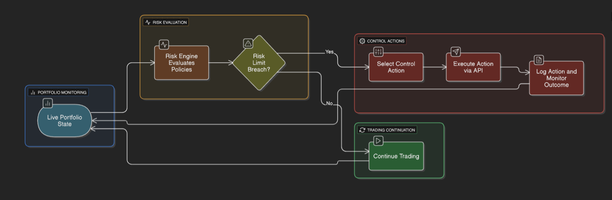

# Monitoring and Risk Control of Live AI Trading Strategies

## Question

Describe how you would:
- Monitor a live AI strategy in production
- Detect anomalies in model output or PnL
- Perform real-time risk control actions based on volatility spikes or position drift

---

Deploying an AI-driven trading strategy requires a multi-layered framework for monitoring, anomaly detection, and real-time risk control. This ensures operational resilience, adherence to risk limits, and the ability to respond dynamically to adverse market conditions. Below is a structured approach to implementing such a system.

---

## 1. Live Strategy Monitoring in Production

Continuous monitoring provides a real-time view of the strategy's health across three key dimensions: model performance, financial outcomes, and system infrastructure.

### A. Key Performance Indicators (KPIs) to Monitor

- **Model Performance:** Prediction drift, confidence scores, and feature drift.
- **Financial Performance:** Real-time PnL, Sharpe ratio, drawdowns, and position exposure.
- **Execution & Systems Health:** Slippage, fill rates, order latency, and system heartbeats.

### B. Monitoring Infrastructure

A robust monitoring stack includes low-latency data pipelines (e.g., Kafka), a time-series database (e.g., InfluxDB), visualization dashboards (e.g., Grafana), and an alerting system (e.g., PagerDuty).

### C. Implementation Workflow

The monitoring workflow is a continuous loop of data aggregation, visualization, and threshold-based alerting.

  
_Figure 1: Monitoring workflow showing data flow from streams to alerts_

---

## 2. Anomaly Detection in Model Output and PnL

Anomaly detection moves beyond simple thresholding to identify unusual patterns that may indicate a problem.

### A. Detection Techniques

- **Statistical Methods:** Z-Score analysis, time-series forecasting (e.g., ARIMA).
- **Machine Learning Methods:** Isolation Forest, Autoencoders.

### B. Implementation Workflow

This workflow enriches raw data to create features, which are then fed into parallel detection models. A positive detection triggers a triage process.

  
_Figure 2: Anomaly detection workflow showing parallel statistical and ML monitoring_

---

## 3. Real-Time Risk Control Actions

Once an anomaly or threshold breach is confirmed, automated or semi-automated risk controls must be executed.

### A. Control Actions

- **Volatility-Driven:** Dynamic leverage reduction, widening entry spreads, adjusting stop-losses based on ATR.
- **Position/Drawdown-Driven:** Trimming positions that exceed concentration limits, liquidating the portfolio on hitting a max drawdown limit (a "circuit breaker").

### B. Implementation Workflow

The risk control system operates as a feedback loop, continuously checking the portfolio state against risk policies and executing corrective actions when necessary.

  
_Figure 3: Risk control workflow showing the feedback loop for risk management_

### C. Hierarchy of Controls

A practical system uses a tiered approach:
1. **Level 1 (Automated):** Pre-defined, fully automated responses.
2. **Level 2 (Human-in-the-Loop):** The system flags a severe anomaly and proposes an action, but requires human confirmation.
3. **Level 3 (Manual Override):** A "kill switch" to immediately halt the strategy and cancel all orders.

---

## Implementation Notes

- **System Architecture:** Use microservices for modularity and scalability, implement redundancy for critical components, and maintain audit logs for all actions.
- **Risk Management:** Set conservative initial limits, implement gradual position sizing, and regularly review and adjust risk parameters.
- **Monitoring Best Practices:** Set up redundant monitoring systems, implement automated health checks, and maintain detailed logging of all system events.
- **Emergency Procedures:** Document clear escalation paths, maintain contact lists for key personnel, and regularly test emergency procedures.

---