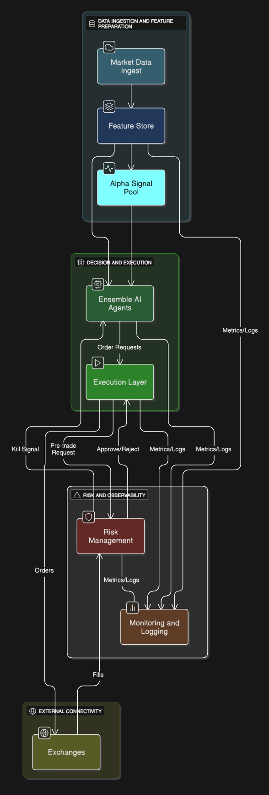

## Architecture for a Low-Latency, Multi-Exchange Ensemble AI Trading System

---

> **Question:** Design an architecture to deploy an ensemble of AI trading agents that share a common alpha signal pool, execute asynchronously, and operate across multiple exchanges (Binance, Coinbase, CME) with low-latency requirements. Include:
> - Execution layer
> - Risk management
> - Feature store
> - Monitoring & logging
> - Failover plan

---

This repository contains the technical design for a high-performance, resilient architecture that addresses the requirements outlined above. The system is built for low-latency, multi-venue, and asynchronous AI-driven trading.

### System Architecture Diagram

The diagram below provides a high-level overview of the system's components and data flows.

---

### 1. System Overview and Design Principles

The architecture is built on three core principles:
1.  **Decoupling:** Signal generation, risk management, and execution are separated into independent microservices for modularity and scalability.
2.  **Low-Latency:** Critical paths are optimized using in-memory databases, efficient messaging queues, and direct exchange connectivity.
3.  **Resilience:** The system is designed for high availability through redundancy, automated failover, and robust monitoring.

The system is logically divided into three planes:
-   **Data Plane:** Ingests market data and generates predictive features and alpha signals.
-   **Execution Plane:** Consumes signals, manages orders, and interacts with exchanges.
-   **Control Plane:** Oversees the system, enforcing risk limits, monitoring health, and managing failover.

---

### 2. Core Components

#### Feature Store
-   **Purpose:** A centralized, versioned, and low-latency source of features for both model training (offline) and live inference (online).
-   **Key Technologies:** Apache Flink/Spark for processing, Redis/Aerospike for the online store, and S3/Parquet for the offline store.

#### Alpha Signal Pool
-   **Purpose:** Decouples signal generation from trading logic. AI models publish abstract predictive signals to a shared bus.
-   **Key Technologies:** NVIDIA Triton for model serving, Redis Pub/Sub for low-latency distribution, and Apache Kafka for durable, replayable streams.

#### Execution Layer
-   **Purpose:** Abstracts exchange-specific complexities and provides a unified interface for order management and smart order routing.
-   **Key Technologies:** Python/Kubernetes for AI agents, C++/Go/Rust for high-performance OMS/SOR/Gateways, and Kafka for durable order queues.

#### Risk Management
-   **Purpose:** Acts as a real-time, centralized safety layer that enforces risk limits via pre-trade checks and post-trade monitoring.
-   **Key Technologies:** Go/C++ for the core engine, Redis for in-memory state, and Open Policy Agent (OPA) for dynamic rule definition.

#### Monitoring & Logging
-   **Purpose:** Provides end-to-end system observability using the "Three Pillars" approach.
-   **Key Technologies:** Prometheus & Grafana (Metrics), Loki/ELK Stack (Logging), and Jaeger/OpenTelemetry (Tracing).

---

### 3. Failover Plan

A multi-layered failover plan ensures high availability by automating recovery where possible.

| Failure Scenario             | Detection Method                  | Automated Response                                                                 |
| ---------------------------- | --------------------------------- | ---------------------------------------------------------------------------------- |
| **AI Agent Pod Crash**       | Kubernetes liveness probe fails.  | K8s restarts the pod; agent recovers state from Kafka.                             |
| **Exchange Gateway Disconnect** | Heartbeat failure or API errors.  | SOR marks venue as "unavailable" and re-routes orders. Ops team is alerted.      |
| **Risk Engine Unresponsive** | Health check from OMS fails.      | OMS enters "cancel-only" mode. **Requires manual intervention.**                   |
| **Datacenter/Region Failure**  | Monitoring detects connectivity loss. | DNS/Load-balancer failover is triggered to a hot-standby replica in a secondary region. |